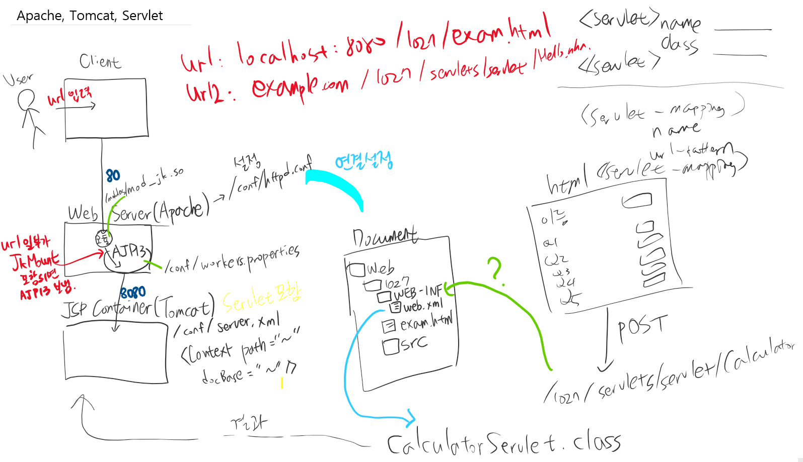

# 프로그램 설치

## Apache Tomcat

[Tomcat](https://github.com/swacademy/Servlet/blob/master/How%20to%20Install%20Apache%20Tomcat%209%20on%20Windows%2010.pdf)

### Install
https://tomcat.apache.org/download-90.cgi

32-bit/64-bit Windows Service Installer 설치하기

exe 파일 실행 
1. Choose Components : check all
2. Configuration : Port 그대로 쓰기 (8080은 Oracle이랑 충돌나니까 Oracle 끄기), username = admin / pw = javatomcat
3. jre : 14


환경변수 > 새로 만들기

이름 : CATALINA_HOME  
경로 : C:\Program Files\Apache Software Foundation\Tomcat 9.0  

서비스에서 실행하면 localhost:8080 으로 접속


### 환경설정
conf > xml, properties

[Apache, Tomcat 연동](https://github.com/swacademy/Servlet/blob/master/Apache%202.4%EC%99%80%20Tomcat%209%20%EC%97%B0%EB%8F%99%ED%95%98%EA%B8%B0%20in%20Windows%2010.pdf)


## Eclipse

[설치 링크](https://www.eclipse.org/downloads/download.php?file=/technology/epp/downloads/release/2020-09/R/eclipse-jee-2020-09-R-win32-x86_64.zip)

Eclipse MarketPlace에서 Tomcatplugin 설치

### 환경설정 (Preferences)

General/Workspace > Encoding  UTF-8

Web/CSS, HTML, JSP Encoding UTF-8

Tomcat > Ver 9.0+, Server.xml

Tomcat > Tomcat Home : C:\Program Files\Apache Software Foundation\Tomcat 9.0

Tomcat/Advanced > Tomcat base : C:\Program Files\Apache Software Foundation\Tomcat 9.0

Tomcat/Tomcat Manager App : admin/javatomcat


server.xml 파일 21번째 line 수정 (<Server port="8005" shutdown="SHUTDOWN">)
서비스에 있는 Tomcat 중지, 이후에는 Eclipse 내에 있는 고양이 눌러서 시작/종료 가능


# Servlet


★최초 유저가 요청할 때부터 유저가 웹페이지를 보게 되는 과정★ 

1. User는 www.example.com/1027/servlets/servlet/Hello.nhn으로 요청한다.

2. 유저의 요청을 Apache(웹서버)가 수신할 때, 확장자 또는 URL경로상에 
   미리 약속한 JkMount가 발견되면 본인이 처리하지 않고 AJP13에게 forward한다.

3. AJP13은 자기가 연결된 Tomcat에게 요청한다.

4. 요청을 받은 Tomcat의 server.xml은 요청경로의 
   1027의 docBase를 참조하여 D:/WebHome/1027/Web-INF/web.xml로 넘겨준다.

5. 해당 web.xml은 user가 요청한 url을 보고 <servlet-mapping>밑의 <url-pattern>과 일치되는
   server-name을 찾는다.

6. 일치되는 servlet-name인 HelloWorld를 찾아서 <servlet> 밑의 해당 이름과 같은
   servlet-class를 찾는다.

7. 그래서 일치되는 servlet-class를 찾으면 해당 클래스를 메모리에 로딩하고 실행하여
   그 결과를 Apache(웹 서버)에게 출력한다.

8. Tomcat으로 전달받은 출력문자열을 그대로 유저에게 response한다.

9. 유저의 브라우저는 웹서버로부터 받은 문자열을 DOM(Tree 구조)로 Parsing하고, 그다음 유저의
   메모리에 로딩하고 웹페이지에 Rendering한다.

> IP는 공항. 3계층, Port는 게이트. 4계층,  
7계층은 Application (Apache, Tomcat, Oracle)

> 8080 터널을 통해 오니까 바로 톰캣, 8080 안쓰면 Apache로 간다.

> AJP에서 Tomcat으로 가는 통로는 8009



위 그림에서는 web.xml 파일에서 <servlet-mapping> / <servlet>로 매핑하고있는데

@WebServlet annotation을 이용하면 굳이 매핑할 필요없음

> @WebServlet("urlPattern")


### 톰캣-서블릿-자바 연동 확인하기!

url = localhost:8080/1028/servlets/servlet/Register 

기본지식
1. 포트번호 8080이니까 Client에서 Tomcat으로 바로 전송  
2. /1028을 입력하면 Root/1028로 전송 (Root랑 1028이 있는지 톰캣 conf 확인)  
3. /servlets/servlet/Register  을 보내면 이를 받아주는 자바 **클래스** 파일 필요.
(이 때, WebAnnotation 형태로 받는지, servlet-mapping 형태로 받는지 확인)  


체크리스트
1. Tomcat이 Root 잡고있는지 (homecontext.xml의 docBase)
2. Tomcat이 1028을 잡고있는지 (server.xml의 Context)
3. 1028디렉토리 metadata-complete (1028/WEB-INF/web.xml > false) 
	<!--false는 WebServlet Annotation 쓰겠다는 뜻-->
4. form에서 POST로 보내는 링크주소 확인 (register.html )
5. @WebServlet() 내의 URL 확인 (register.java )
6. 컴파일된 클래스파일 있는지 확인 (WEB-INF/classes/~.class )


## MySQL Download

[Community](https://dev.mysql.com/downloads/file/?id=499590)

[Workbench](https://dev.mysql.com/downloads/workbench/)

## MariaDB Download

https://mariadb.org/download/

## Oracle 

Oracle XE 184

https://www.oracle.com/kr/database/technologies/appdev/xe.html


### War
출처: https://dololak.tistory.com/31

WAR(WebApplication Archive)
WAR란 WebApplication Archive의 약자로 말그대로 웹 어플리케이션 저장소이며 웹 어플리케이션을 압축해 저장해 놓은 파일이라고 생각하시면 됩니다.

개발한 웹어플리케이션 프로젝트가 WAS에서 돌아갈 수 있는 구조를 담고 있으며 JSP 및 서블릿 빈클래스 등의 소스가 컴파일 되어 저장되며 기타 이미지 및 자원들이 포함되어 있습니다.
 

#### War 배포

WAS에 웹 어플리케이션을 배포하기 위해서는 톰캣을 기준으로 다음의 세가지 방법이 있습니다.

1. 웹 어플리케이션 프로젝트 그대로 복사하여 WAS webapps 폴더 하위에 복사하여 배포
2. 프로젝트.war 로 압축하여 webapps 폴더 하위에 복사한 후 톰캣을 기동하여 자동 배포
3. 톰캣 관리자 페이지에서 프로젝트.war 파일을 등록하여 자동으로 배포

1번의 경우 로컬에서 개발하여 테스트를 위해 로컬로 복사하는 경우 편하겠지만 웹 어플리케이션 규모가 크고, 서버가 외부에 있는 경우 수많은 폴더들과 파일을 통째로 옮겨야 하기 때문에 번거롭습니다.

2, 3번의 경우에는 로컬에서 개발하여 FTP 등을 통해 원격 운영서버로 war파일만 옮겨 배포하는 경우등에 유용합니다.

# JSP

## JSP 컨테이너의 역할
웹 브라우저가 JSP 페이지 요청이 오면 JSP 컨테이너는 해당 jsp 파일을 '서블릿'이라고 부르는 자바 파일로 변환시킨다. 그 다음 자바 파일을 컴파일하고, 클래스 파일의 실행결과가 사용자의 브라우저로 전송된다.

(3~6은 JSP 컨테이너에서 실행됨)
1. 웹브라우저가 웹서버에게 JSP 페이지 요청
2. 웹 서버가 JSP 컨테이너로 전송
3. JSP 파일 파싱
4. 서블릿으로 변환
5. 클래스 파일 생성
6. 메모리에 적재되어 실행됨
7. 웹 서버로 HTML 전송
8. 웹 브라우저에 HTML 표시


## JSP 문법 요소
### 스크립트 요소
1. 선언문 (Declaration)
2. 스크립트릿 (Scriptlet)
3. 표현식 (Expression)

### 주석 (Comment)
4. 주석

### 지시자
5. 지시자 (Directive)

### 액션 태그 (Action Tag)
6. Action Tag

---

1. declartion

변수나 메소드 선언

멤버변수!

객체 생성시, 멤버변수가 먼저 만들어지고 다음에 메소드가 만들어진다.
```jsp
<%! %>
```

2. scriptlet 

지역변수 선언. 메소드 선언은 불가능

technically, _jspService 메소드 안에 선언되는 요소다.

```jsp
<% Java Code %>
```


3. expression

표현식은 결과로만 출력할 수 있다. if/else 등은 불가능

변수를 출력하거나 메소드의 결과값을 브라우저에 출력한다.

```jsp
<%= %>
```

4. comment
> 자바,JSP 모두 주석처리

JSP내에 아래처럼 입력하면 소스 보기를 해도 주석이 나타나지 않는다.
```jsp
<%-- --%>
```
JSP내에 HTML의 주석 (`<!-- -->`)을 넣으면 소스보기 할 때 주석 코드가 보인다.

스크립트릿이나 선언문에서는 아래와 같은 주석처리방법이 사용된다.
```
<% /* 여러 줄 주석 */ %>
<% // 한줄 주석 %>
```


5. directive(지시자, 지시부)

클라이언트의 요청에 jsp 페이지가 실행이 될 때 필요한 정보를 JSP 컨테이너에게 알리는 역할

```jsp
<%@ page ~ %>
<%@ include ~ %>
<%@ taglib ~ %>

<%-- 
page
- info
- language
- contentType
- extends
- import
- session
- buffer
- autoFlush
- isThreadSafe
- trimDirectiveWhitespaces
- errorPage
- isErrorPage
- pageEncoding

include
- file
--%>
```

6. action tag
```jsp
<jsp:~ />
<%--
- include
- forward
- plug-in
- useBean
- setProperty
- getProperty
--%>
```

## 내부 객체 (implicit object)
내부 객체란 jsp 페이지를 작성할 때 특별한 기능을 제공하는 JSP 컨테이너가 제공하는 특별한 객체를 말한다. 즉, 위의 JSP 문법요소들과 함께 동작해 사용자의 요청을 적절히 처리하여 동적으로 HTML을 생성한다.

### 입출력 관련

### 외부 환경 정보 제공

### 서블릿 관련

### 예외 관련


내부 객체 (9가지)
1. 


EL & JSTL

Custom Tag